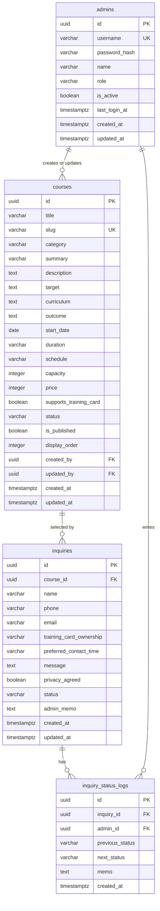

# 비트컴퓨터학원 홈페이지 데이터베이스 설계서

## 1. 문서 개요

- 대상 서비스: 비트컴퓨터학원 홈페이지
- 운영 도메인: bit-edu.com
- 권장 데이터베이스: PostgreSQL
- 목적:
  - 교육과정, 문의, 관리자 계정 데이터를 안정적으로 저장한다.
  - 방문자 검색/필터와 관리자 관리 기능을 지원한다.
  - 추후 과정 분류, 관리자, 상담 상태 확장에 대응한다.

## 2. 설계 원칙

- 방문자 화면에는 공개 상태인 교육과정만 노출한다.
- 문의/신청은 정식 수강 신청이 아니라 상담 문의로 저장한다.
- 관리자 계정 비밀번호는 평문 저장을 금지하고 해시값만 저장한다.
- 삭제가 필요한 운영 데이터는 가능한 한 물리 삭제보다 상태 변경을 우선한다.
- 과정명 검색, 분류 필터, 모집 상태 필터가 빠르게 동작하도록 인덱스를 둔다.

## 3. 테이블 목록

| 테이블명 | 설명 |
| --- | --- |
| admins | 관리자 계정 |
| courses | 교육과정 |
| inquiries | 상담 문의 |
| inquiry_status_logs | 문의 처리 상태 변경 이력 |

초기 버전에서는 `courses`, `inquiries`, `admins`만으로도 구현 가능하다.  
`inquiry_status_logs`는 문의 처리 이력을 남기기 위한 권장 테이블이다.

## 4. 코드값 정의

### 4.1 과정 분류 course_category

| 값 | 표시명 | 설명 |
| --- | --- | --- |
| GENERAL | 일반과정 | 학원 자체 일반 교육과정 |
| TRAINING_CARD | 국민내일배움카드과정 | 국민내일배움카드 적용 과정 |

### 4.2 모집 상태 course_status

| 값 | 표시명 | 설명 |
| --- | --- | --- |
| RECRUITING | 모집중 | 현재 문의/모집 가능 |
| SCHEDULED | 예정 | 개강 또는 모집 예정 |
| CLOSED | 마감 | 모집 마감 |

### 4.3 문의 처리 상태 inquiry_status

| 값 | 표시명 | 설명 |
| --- | --- | --- |
| NEW | 신규 | 새로 접수된 문의 |
| CHECKING | 확인중 | 관리자가 확인 또는 상담 진행 중 |
| COUNSELING_DONE | 상담완료 | 상담 완료 |
| ENROLLED | 신청완료 | 실제 수강 신청으로 이어짐 |
| HOLD | 보류 | 후속 확인 필요 |

### 4.4 국민내일배움카드 보유 여부 training_card_ownership

| 값 | 표시명 |
| --- | --- |
| YES | 예 |
| NO | 아니오 |
| UNKNOWN | 잘 모르겠음 |

## 5. ERD



## 6. 테이블 상세

## 6.1 admins

관리자 계정 테이블.

| 컬럼 | 타입 | 필수 | 기본값 | 설명 |
| --- | --- | --- | --- | --- |
| id | uuid | 예 | gen_random_uuid() | 관리자 ID |
| username | varchar(50) | 예 | - | 로그인 아이디 |
| password_hash | varchar(255) | 예 | - | 비밀번호 해시 |
| name | varchar(50) | 예 | - | 관리자 이름 |
| role | varchar(20) | 예 | ADMIN | 권한 |
| is_active | boolean | 예 | true | 계정 활성 여부 |
| last_login_at | timestamptz | 아니오 | null | 마지막 로그인 |
| created_at | timestamptz | 예 | now() | 생성일 |
| updated_at | timestamptz | 예 | now() | 수정일 |

제약조건:
- `username`은 유일해야 한다.
- `role` 기본값은 `ADMIN`으로 둔다.

운영 정책:
- 일반 회원가입은 제공하지 않는다.
- 최초 관리자 계정 1개를 배포 시 생성한다.
- 최초 로그인 후 비밀번호 변경 기능을 제공하는 것이 좋다.

## 6.2 courses

교육과정 테이블.

| 컬럼 | 타입 | 필수 | 기본값 | 설명 |
| --- | --- | --- | --- | --- |
| id | uuid | 예 | gen_random_uuid() | 과정 ID |
| title | varchar(150) | 예 | - | 과정명 |
| slug | varchar(180) | 예 | - | URL용 식별자 |
| category | varchar(30) | 예 | - | 과정 분류 |
| summary | varchar(300) | 예 | - | 짧은 소개 |
| description | text | 예 | - | 상세 소개 |
| target | text | 아니오 | null | 교육 대상 |
| curriculum | text | 아니오 | null | 커리큘럼 |
| outcome | text | 아니오 | null | 수료 후 기대 효과 |
| start_date | date | 아니오 | null | 개강일 |
| duration | varchar(100) | 아니오 | null | 교육 기간 |
| schedule | varchar(100) | 아니오 | null | 교육 시간 |
| capacity | integer | 아니오 | null | 모집 인원 |
| price | integer | 아니오 | null | 수강료 |
| supports_training_card | boolean | 예 | false | 국민내일배움카드 적용 여부 |
| status | varchar(30) | 예 | SCHEDULED | 모집 상태 |
| is_published | boolean | 예 | true | 공개 여부 |
| display_order | integer | 예 | 0 | 노출 순서 |
| created_by | uuid | 아니오 | null | 등록 관리자 |
| updated_by | uuid | 아니오 | null | 수정 관리자 |
| created_at | timestamptz | 예 | now() | 생성일 |
| updated_at | timestamptz | 예 | now() | 수정일 |

제약조건:
- `slug`는 유일해야 한다.
- `category`는 `GENERAL`, `TRAINING_CARD` 중 하나여야 한다.
- `status`는 `RECRUITING`, `SCHEDULED`, `CLOSED` 중 하나여야 한다.
- `capacity`는 0보다 커야 한다.
- `price`는 0 이상이어야 한다.

검색/필터 기준:
- 과정명 검색: `title`
- 분류 필터: `category`
- 모집 상태 필터: `status`
- 공개 여부 필터: `is_published`

## 6.3 inquiries

상담 문의 테이블.

| 컬럼 | 타입 | 필수 | 기본값 | 설명 |
| --- | --- | --- | --- | --- |
| id | uuid | 예 | gen_random_uuid() | 문의 ID |
| course_id | uuid | 아니오 | null | 관심 과정 |
| name | varchar(50) | 예 | - | 문의자 이름 |
| phone | varchar(30) | 예 | - | 연락처 |
| email | varchar(100) | 아니오 | null | 이메일 |
| training_card_ownership | varchar(20) | 아니오 | null | 국민내일배움카드 보유 여부 |
| preferred_contact_time | varchar(100) | 아니오 | null | 희망 상담 시간 |
| message | text | 예 | - | 문의 내용 |
| privacy_agreed | boolean | 예 | false | 개인정보 동의 여부 |
| status | varchar(30) | 예 | NEW | 처리 상태 |
| admin_memo | text | 아니오 | null | 관리자 메모 |
| created_at | timestamptz | 예 | now() | 접수일 |
| updated_at | timestamptz | 예 | now() | 수정일 |

제약조건:
- `privacy_agreed`는 반드시 true여야 문의 접수가 가능하다.
- `status`는 `NEW`, `CHECKING`, `COUNSELING_DONE`, `ENROLLED`, `HOLD` 중 하나여야 한다.
- `training_card_ownership`은 null 또는 `YES`, `NO`, `UNKNOWN` 중 하나여야 한다.

개인정보 주의:
- 연락처와 이메일은 개인정보에 해당한다.
- 관리자 화면 외부에 노출하지 않는다.
- 운영 정책에 따라 보관 기간과 삭제 정책을 정해야 한다.

## 6.4 inquiry_status_logs

문의 처리 상태 변경 이력 테이블.

| 컬럼 | 타입 | 필수 | 기본값 | 설명 |
| --- | --- | --- | --- | --- |
| id | uuid | 예 | gen_random_uuid() | 이력 ID |
| inquiry_id | uuid | 예 | - | 문의 ID |
| admin_id | uuid | 아니오 | null | 처리 관리자 |
| previous_status | varchar(30) | 아니오 | null | 이전 상태 |
| next_status | varchar(30) | 예 | - | 변경 상태 |
| memo | text | 아니오 | null | 변경 메모 |
| created_at | timestamptz | 예 | now() | 변경일 |

사용 목적:
- 문의 처리 상태가 언제, 누구에 의해 변경되었는지 기록한다.
- 초기 개발 범위를 줄이고 싶다면 2차 개발로 미뤄도 된다.

## 7. 인덱스 설계

| 테이블 | 인덱스 | 목적 |
| --- | --- | --- |
| admins | username unique | 로그인 아이디 조회 |
| courses | slug unique | 상세 페이지 조회 |
| courses | category | 분류 필터 |
| courses | status | 모집 상태 필터 |
| courses | is_published | 방문자 노출 필터 |
| courses | title | 과정명 검색 |
| inquiries | course_id | 과정별 문의 조회 |
| inquiries | status | 문의 처리 상태 필터 |
| inquiries | created_at | 최근 문의 정렬 |
| inquiry_status_logs | inquiry_id | 문의별 이력 조회 |

## 8. PostgreSQL DDL 초안

```sql
create extension if not exists pgcrypto;

create table admins (
  id uuid primary key default gen_random_uuid(),
  username varchar(50) not null unique,
  password_hash varchar(255) not null,
  name varchar(50) not null,
  role varchar(20) not null default 'ADMIN',
  is_active boolean not null default true,
  last_login_at timestamptz,
  created_at timestamptz not null default now(),
  updated_at timestamptz not null default now()
);

create table courses (
  id uuid primary key default gen_random_uuid(),
  title varchar(150) not null,
  slug varchar(180) not null unique,
  category varchar(30) not null,
  summary varchar(300) not null,
  description text not null,
  target text,
  curriculum text,
  outcome text,
  start_date date,
  duration varchar(100),
  schedule varchar(100),
  capacity integer,
  price integer,
  supports_training_card boolean not null default false,
  status varchar(30) not null default 'SCHEDULED',
  is_published boolean not null default true,
  display_order integer not null default 0,
  created_by uuid references admins(id) on delete set null,
  updated_by uuid references admins(id) on delete set null,
  created_at timestamptz not null default now(),
  updated_at timestamptz not null default now(),
  constraint courses_category_check check (category in ('GENERAL', 'TRAINING_CARD')),
  constraint courses_status_check check (status in ('RECRUITING', 'SCHEDULED', 'CLOSED')),
  constraint courses_capacity_check check (capacity is null or capacity > 0),
  constraint courses_price_check check (price is null or price >= 0)
);

create table inquiries (
  id uuid primary key default gen_random_uuid(),
  course_id uuid references courses(id) on delete set null,
  name varchar(50) not null,
  phone varchar(30) not null,
  email varchar(100),
  training_card_ownership varchar(20),
  preferred_contact_time varchar(100),
  message text not null,
  privacy_agreed boolean not null default false,
  status varchar(30) not null default 'NEW',
  admin_memo text,
  created_at timestamptz not null default now(),
  updated_at timestamptz not null default now(),
  constraint inquiries_privacy_agreed_check check (privacy_agreed = true),
  constraint inquiries_status_check check (status in ('NEW', 'CHECKING', 'COUNSELING_DONE', 'ENROLLED', 'HOLD')),
  constraint inquiries_training_card_check check (
    training_card_ownership is null
    or training_card_ownership in ('YES', 'NO', 'UNKNOWN')
  )
);

create table inquiry_status_logs (
  id uuid primary key default gen_random_uuid(),
  inquiry_id uuid not null references inquiries(id) on delete cascade,
  admin_id uuid references admins(id) on delete set null,
  previous_status varchar(30),
  next_status varchar(30) not null,
  memo text,
  created_at timestamptz not null default now()
);

create index idx_courses_category on courses(category);
create index idx_courses_status on courses(status);
create index idx_courses_is_published on courses(is_published);
create index idx_courses_title on courses(title);
create index idx_inquiries_course_id on inquiries(course_id);
create index idx_inquiries_status on inquiries(status);
create index idx_inquiries_created_at on inquiries(created_at desc);
create index idx_inquiry_status_logs_inquiry_id on inquiry_status_logs(inquiry_id);
```

## 9. 초기 교육과정 데이터

초기 데이터는 상세 정보가 확정되지 않았으므로 과정명, 분류, 기본 소개, 공개 여부 중심으로 등록한다.

### 9.1 일반과정

| 과정명 | slug | 분류 | 카드 적용 |
| --- | --- | --- | --- |
| ITQ | itq | GENERAL | false |
| 정보처리 | information-processing | GENERAL | false |
| 사무자동화 | office-automation | GENERAL | false |
| 포토샵 | photoshop | GENERAL | false |
| 일러스트 | illustrator | GENERAL | false |
| 컴퓨터그래픽스 | computer-graphics | GENERAL | false |
| 엑셀실무 | practical-excel | GENERAL | false |
| 컴퓨터활용능력1급 | computer-literacy-level-1 | GENERAL | false |
| 워드프로세서 | word-processor | GENERAL | false |

### 9.2 국민내일배움카드과정

| 과정명 | slug | 분류 | 카드 적용 |
| --- | --- | --- | --- |
| ITQ마스터 | itq-master | TRAINING_CARD | true |
| 컴퓨터활용능력1급실기 | computer-literacy-level-1-practical | TRAINING_CARD | true |
| ITQ한글/엑셀 | itq-hangul-excel | TRAINING_CARD | true |
| 컴퓨터활용능력2급+워드프로세서 | computer-literacy-level-2-word-processor | TRAINING_CARD | true |

## 10. 초기 데이터 INSERT 예시

```sql
insert into courses (
  title,
  slug,
  category,
  summary,
  description,
  supports_training_card,
  status,
  is_published,
  display_order
) values
('ITQ', 'itq', 'GENERAL', 'ITQ 자격증 대비 과정입니다.', 'ITQ 자격증 취득을 목표로 문서 작성과 실무 활용 능력을 학습합니다.', false, 'RECRUITING', true, 10),
('정보처리', 'information-processing', 'GENERAL', '정보처리 관련 자격 및 기초 이론 과정입니다.', '정보처리 분야의 기본 개념과 자격 대비 내용을 학습합니다.', false, 'RECRUITING', true, 20),
('사무자동화', 'office-automation', 'GENERAL', '사무자동화 실무와 자격 대비 과정입니다.', '문서, 스프레드시트, 사무 자동화 활용 능력을 학습합니다.', false, 'RECRUITING', true, 30),
('포토샵', 'photoshop', 'GENERAL', '포토샵 기초부터 실무 활용까지 배우는 과정입니다.', '이미지 편집, 보정, 디자인 작업에 필요한 포토샵 기능을 학습합니다.', false, 'RECRUITING', true, 40),
('일러스트', 'illustrator', 'GENERAL', '일러스트 디자인 실무 과정입니다.', '벡터 그래픽, 로고, 인쇄물 제작에 필요한 일러스트 기능을 학습합니다.', false, 'RECRUITING', true, 50),
('컴퓨터그래픽스', 'computer-graphics', 'GENERAL', '컴퓨터그래픽스 자격 및 디자인 실무 과정입니다.', '그래픽 디자인과 관련 자격 대비 내용을 학습합니다.', false, 'RECRUITING', true, 60),
('엑셀실무', 'practical-excel', 'GENERAL', '업무에 바로 쓰는 엑셀 실무 과정입니다.', '함수, 표, 데이터 정리 등 실무 중심의 엑셀 활용법을 학습합니다.', false, 'RECRUITING', true, 70),
('컴퓨터활용능력1급', 'computer-literacy-level-1', 'GENERAL', '컴퓨터활용능력 1급 자격 대비 과정입니다.', '스프레드시트와 데이터베이스 활용 능력을 자격 시험 기준에 맞춰 학습합니다.', false, 'RECRUITING', true, 80),
('워드프로세서', 'word-processor', 'GENERAL', '워드프로세서 자격 대비 과정입니다.', '문서 작성과 편집 능력을 중심으로 워드프로세서 자격을 준비합니다.', false, 'RECRUITING', true, 90),
('ITQ마스터', 'itq-master', 'TRAINING_CARD', '국민내일배움카드 적용 ITQ 종합 과정입니다.', 'ITQ 주요 과목을 종합적으로 준비하는 국민내일배움카드 과정입니다.', true, 'RECRUITING', true, 110),
('컴퓨터활용능력1급실기', 'computer-literacy-level-1-practical', 'TRAINING_CARD', '국민내일배움카드 적용 컴퓨터활용능력 1급 실기 과정입니다.', '컴퓨터활용능력 1급 실기 시험에 필요한 내용을 집중 학습합니다.', true, 'RECRUITING', true, 120),
('ITQ한글/엑셀', 'itq-hangul-excel', 'TRAINING_CARD', '국민내일배움카드 적용 ITQ 한글/엑셀 과정입니다.', 'ITQ 한글과 엑셀 과목을 중심으로 자격 취득을 준비합니다.', true, 'RECRUITING', true, 130),
('컴퓨터활용능력2급+워드프로세서', 'computer-literacy-level-2-word-processor', 'TRAINING_CARD', '국민내일배움카드 적용 자격증 병행 과정입니다.', '컴퓨터활용능력 2급과 워드프로세서를 함께 준비하는 과정입니다.', true, 'RECRUITING', true, 140);
```

## 11. 관리자 초기 계정 정책

추천 방식:
- 배포 시 환경변수로 초기 관리자 정보를 입력한다.
- 서버 초기화 스크립트가 관리자 계정을 1회 생성한다.
- 이미 관리자 계정이 있으면 중복 생성하지 않는다.

예시 환경변수:

```text
ADMIN_USERNAME=admin
ADMIN_INITIAL_PASSWORD=초기비밀번호
ADMIN_NAME=관리자
```

주의사항:
- 초기 비밀번호는 배포 후 즉시 변경한다.
- 저장 시 반드시 bcrypt 또는 argon2 같은 안전한 해시를 사용한다.
- 운영 문서나 Git 저장소에 실제 비밀번호를 기록하지 않는다.

## 12. 개인정보 및 보관 정책

상담 문의에는 이름, 연락처, 이메일이 포함될 수 있다.

권장 정책:
- 개인정보 수집 및 이용 동의 문구를 문의 폼에 노출한다.
- 문의 목적 달성 후 일정 기간이 지나면 삭제 또는 비식별 처리한다.
- 관리자 외에는 문의 데이터를 볼 수 없게 한다.
- DB 백업 파일도 접근 권한을 제한한다.

추가 확정 필요:
- 문의 데이터 보관 기간
- 개인정보 처리방침 전문
- 이메일 입력을 계속 선택 항목으로 둘지 여부

## 13. 개발 단계 반영 순서

1. `admins` 테이블 생성
2. `courses` 테이블 생성
3. 초기 교육과정 데이터 등록
4. `inquiries` 테이블 생성
5. 방문자 과정 목록/상세 조회 구현
6. 방문자 문의 저장 구현
7. 관리자 로그인 구현
8. 관리자 과정 관리 구현
9. 관리자 문의 관리 구현
10. 필요 시 `inquiry_status_logs` 추가 구현

